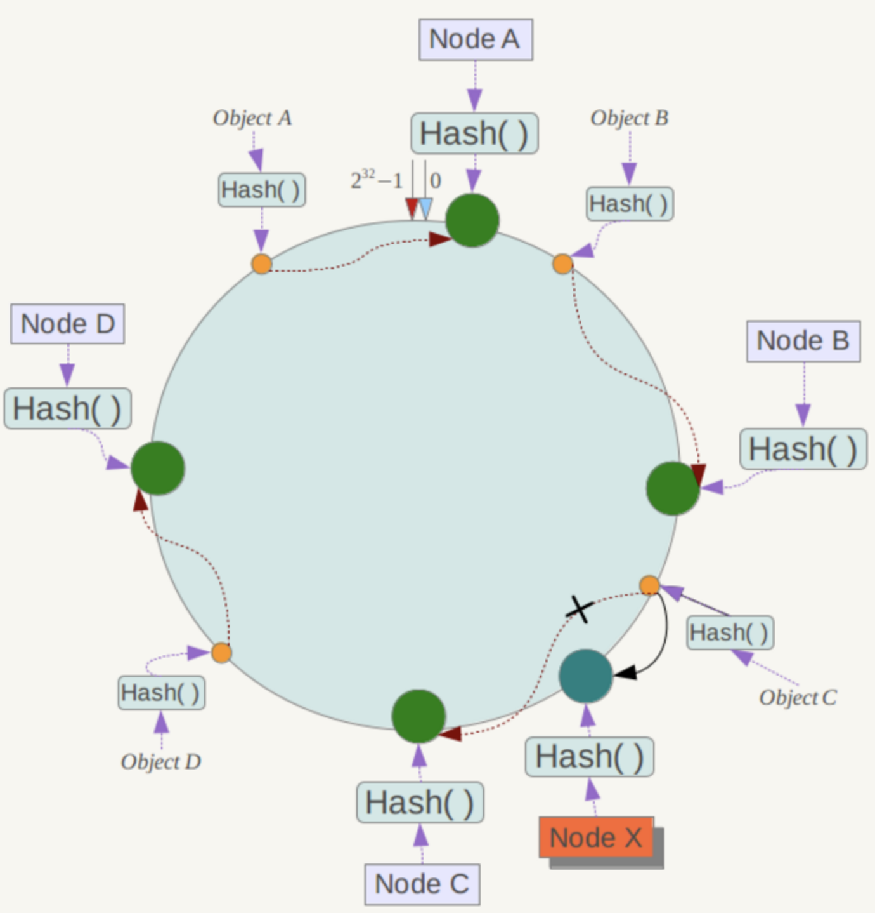

* [单线程架构](#%E5%8D%95%E7%BA%BF%E7%A8%8B%E6%9E%B6%E6%9E%84)
* [数据类型](#%E6%95%B0%E6%8D%AE%E7%B1%BB%E5%9E%8B)
  * [string](#string)
  * [hash](#hash)
  * [list](#list)
  * [set](#set)
  * [zset(sort set)](#zsetsort-set)
  * [位图](#%E4%BD%8D%E5%9B%BE)
  * [HyperLoglog](#hyperloglog)
* [分布式锁](#%E5%88%86%E5%B8%83%E5%BC%8F%E9%94%81)
  * [集群环境下的缺点](#%E9%9B%86%E7%BE%A4%E7%8E%AF%E5%A2%83%E4%B8%8B%E7%9A%84%E7%BC%BA%E7%82%B9)
  * [解决方案](#%E8%A7%A3%E5%86%B3%E6%96%B9%E6%A1%88)
* [布隆过滤器(Bloom Filter)](#%E5%B8%83%E9%9A%86%E8%BF%87%E6%BB%A4%E5%99%A8bloom-filter)
  * [原理](#%E5%8E%9F%E7%90%86)
* [管道(Pipeline)](#%E7%AE%A1%E9%81%93pipeline)
* [事务](#%E4%BA%8B%E5%8A%A1)
* [发布订阅(PubSub)](#%E5%8F%91%E5%B8%83%E8%AE%A2%E9%98%85pubsub)
* [客户端通信协议](#%E5%AE%A2%E6%88%B7%E7%AB%AF%E9%80%9A%E4%BF%A1%E5%8D%8F%E8%AE%AE)
* [持久化](#%E6%8C%81%E4%B9%85%E5%8C%96)
  * [RDB](#rdb)
  * [AOF](#aof)
  * [总结](#%E6%80%BB%E7%BB%93)
  * [持久化阻塞主线程场景](#%E6%8C%81%E4%B9%85%E5%8C%96%E9%98%BB%E5%A1%9E%E4%B8%BB%E7%BA%BF%E7%A8%8B%E5%9C%BA%E6%99%AF)
  * [多实例部署](#%E5%A4%9A%E5%AE%9E%E4%BE%8B%E9%83%A8%E7%BD%B2)
* [主从复制](#%E4%B8%BB%E4%BB%8E%E5%A4%8D%E5%88%B6)
  * [配置](#%E9%85%8D%E7%BD%AE)
    * [断开复制](#%E6%96%AD%E5%BC%80%E5%A4%8D%E5%88%B6)
    * [安全性](#%E5%AE%89%E5%85%A8%E6%80%A7)
    * [repl\-disable\-tcp\-nodelay](#repl-disable-tcp-nodelay)
  * [拓扑结构](#%E6%8B%93%E6%89%91%E7%BB%93%E6%9E%84)
  * [复制原理](#%E5%A4%8D%E5%88%B6%E5%8E%9F%E7%90%86)
    * [6个流程：](#6%E4%B8%AA%E6%B5%81%E7%A8%8B)
    * [数据同步](#%E6%95%B0%E6%8D%AE%E5%90%8C%E6%AD%A5)
    * [心跳](#%E5%BF%83%E8%B7%B3)
    * [异步复制](#%E5%BC%82%E6%AD%A5%E5%A4%8D%E5%88%B6)
  * [开发与运维中的问题](#%E5%BC%80%E5%8F%91%E4%B8%8E%E8%BF%90%E7%BB%B4%E4%B8%AD%E7%9A%84%E9%97%AE%E9%A2%98)
    * [读写分离](#%E8%AF%BB%E5%86%99%E5%88%86%E7%A6%BB)
    * [规避全量复制](#%E8%A7%84%E9%81%BF%E5%85%A8%E9%87%8F%E5%A4%8D%E5%88%B6)
    * [规避复制风暴](#%E8%A7%84%E9%81%BF%E5%A4%8D%E5%88%B6%E9%A3%8E%E6%9A%B4)
* [阻塞](#%E9%98%BB%E5%A1%9E)
  * [发现阻塞](#%E5%8F%91%E7%8E%B0%E9%98%BB%E5%A1%9E)
  * [内在原因](#%E5%86%85%E5%9C%A8%E5%8E%9F%E5%9B%A0)
    * [api或数据结构使用不合理](#api%E6%88%96%E6%95%B0%E6%8D%AE%E7%BB%93%E6%9E%84%E4%BD%BF%E7%94%A8%E4%B8%8D%E5%90%88%E7%90%86)
    * [cpu饱和](#cpu%E9%A5%B1%E5%92%8C)
    * [持久化阻塞](#%E6%8C%81%E4%B9%85%E5%8C%96%E9%98%BB%E5%A1%9E)
  * [外在原因](#%E5%A4%96%E5%9C%A8%E5%8E%9F%E5%9B%A0)
    * [cpu竞争](#cpu%E7%AB%9E%E4%BA%89)
    * [内存交换](#%E5%86%85%E5%AD%98%E4%BA%A4%E6%8D%A2)
    * [网络问题](#%E7%BD%91%E7%BB%9C%E9%97%AE%E9%A2%98)
* [理解内存](#%E7%90%86%E8%A7%A3%E5%86%85%E5%AD%98)
  * [内存管理](#%E5%86%85%E5%AD%98%E7%AE%A1%E7%90%86)
    * [内存回收策略](#%E5%86%85%E5%AD%98%E5%9B%9E%E6%94%B6%E7%AD%96%E7%95%A5)
  * [LRU算法](#lru%E7%AE%97%E6%B3%95)
    * [java实现LRU](#java%E5%AE%9E%E7%8E%B0lru)
  * [内存优化](#%E5%86%85%E5%AD%98%E4%BC%98%E5%8C%96)
    * [redisObject对象](#redisobject%E5%AF%B9%E8%B1%A1)
    * [缩减键值对象](#%E7%BC%A9%E5%87%8F%E9%94%AE%E5%80%BC%E5%AF%B9%E8%B1%A1)
    * [共享对象池](#%E5%85%B1%E4%BA%AB%E5%AF%B9%E8%B1%A1%E6%B1%A0)
    * [字符串优化](#%E5%AD%97%E7%AC%A6%E4%B8%B2%E4%BC%98%E5%8C%96)
* [哨兵(Sentinel )](#%E5%93%A8%E5%85%B5sentinel-)
  * [基本概念](#%E5%9F%BA%E6%9C%AC%E6%A6%82%E5%BF%B5)
    * [主从复制](#%E4%B8%BB%E4%BB%8E%E5%A4%8D%E5%88%B6-1)
    * [Redsi Sentinel 的高可用性](#redsi-sentinel-%E7%9A%84%E9%AB%98%E5%8F%AF%E7%94%A8%E6%80%A7)
    * [配置](#%E9%85%8D%E7%BD%AE-1)
  * [客户端连接](#%E5%AE%A2%E6%88%B7%E7%AB%AF%E8%BF%9E%E6%8E%A5)
  * [Redis Sentinel实现原理](#redis-sentinel%E5%AE%9E%E7%8E%B0%E5%8E%9F%E7%90%86)
    * [三个定时监控任务](#%E4%B8%89%E4%B8%AA%E5%AE%9A%E6%97%B6%E7%9B%91%E6%8E%A7%E4%BB%BB%E5%8A%A1)
    * [客观下线和主观下线](#%E5%AE%A2%E8%A7%82%E4%B8%8B%E7%BA%BF%E5%92%8C%E4%B8%BB%E8%A7%82%E4%B8%8B%E7%BA%BF)
    * [领导者Sentinel节点选举](#%E9%A2%86%E5%AF%BC%E8%80%85sentinel%E8%8A%82%E7%82%B9%E9%80%89%E4%B8%BE)
    * [故障转移](#%E6%95%85%E9%9A%9C%E8%BD%AC%E7%A7%BB)
* [集群(Cluster)](#%E9%9B%86%E7%BE%A4cluster)
* [缓存](#%E7%BC%93%E5%AD%98)
  * [缓存更新策略](#%E7%BC%93%E5%AD%98%E6%9B%B4%E6%96%B0%E7%AD%96%E7%95%A5)
  * [缓存粒度控制](#%E7%BC%93%E5%AD%98%E7%B2%92%E5%BA%A6%E6%8E%A7%E5%88%B6)
  * [穿透优化](#%E7%A9%BF%E9%80%8F%E4%BC%98%E5%8C%96)
  * [缓存雪崩优化](#%E7%BC%93%E5%AD%98%E9%9B%AA%E5%B4%A9%E4%BC%98%E5%8C%96)
  * [缓存击穿](#%E7%BC%93%E5%AD%98%E5%87%BB%E7%A9%BF)

### 单线程架构

- redis使用**单线程架构**和**IO多路复用模型**实现高性能的内存数据库服务。一条命令从客户端到达服务端不会立即被执行，所有命令都会进入一个队列中，然后逐个被执行。单线程模型还会达到每秒万级别的处理能力原因：

  1.  **纯内存访问。**基于内存数据库来进行存和读取数据的。
  2. **非阻塞`IO`。**(使用`epoll`作为`IO`多路复用技术的实现，在加上`Redis`自身的事件处理模型将`epoll`中的连接、读写、关闭都转为事件，不在`IO`上浪费过多事件)
  3. 单线程避免的线程切换和竞态产生的消耗。

- 单线程模型中，如果某个命令执行时间过长，会阻塞其他命令，所以`Redis`是面向快速执行场景的数据库。

### 数据类型

#### `string`

- 内部编码
  1. `int`（8字节长整型）
  2. `embstr`（<=39字节的字符串）
  3. `raw`（>39字节的字符串）
  
- 操作：

  `mset` 和 `mget `可以对多个字符串读写 节省网络开销.**`redis`的`string`是动态的，可修改的，而且可以用来存储整数。**
  
- 内部的实现是通过 **SDS**（Simple Dynamic String ）来存储的。

  ```c
  struct sdshdr {
    // 已使用的字节数
    int len;
    // 剩余字节数
    int free;
    // 字节数组，用来保存字符串
    char buf[];
  }
  ```

- 与`C`对比
  - SDS二进制安全。C字符串的字符必须符合某种编码，并且除了末尾以外，不能包含空字符，所以如果保存二进制数据的话，会误以为空字符是字符串结尾。而SDS是通过len属性来判断是否结束，从而可以保存任意格式的二进制数据。
  - C字符串不会记录自身的长度，所以如果想要获取C字符串的长度信息就意味着要把整个字符串遍历一遍，这样获取长度的时间复杂度就为O(n)。而在SDS中，用了len字段来记录字符串的长度，这样获取长度的之间复杂度就降低到了O(1)。

#### `hash`

- 内部编码
  1. `ziplist`（`ziplist`更紧凑，比`hashtable`节省内存，当元素个数小于`hash-max-ziplist-entries` (默认`512`个)`&& `所有的值小于`hash-max-ziplist-value`(默认64字节)时用`ziplist`）
  2. `hashtable`（`hashtable`读写时间复杂度为`O(1)`，比`ziplist`效率高）
  
- 与`string`区别

  比如存储用户信息，`hash `也可以用来存储用户信息,和 `string `不同的是 `hash `可以对用户信息的每个字段单独存储,`string` 则需要序列化用户的所有字段后存储.并且 `string` 需要以整个字符串的形式获取用户,而 `hash`可以只获取部分数据,从而节约网络流量.不过 `hash` 内存占用要大于 `sring`,这是` hash` 的缺点。

- 和 `Java`的 `HashMap `相似,是**数组+链表**的结构.**当发生 hash 碰撞时将会把元素追加到链表上。但这里的`hash`值只能是字符串。**

- 扩容

  **渐进式hash策略**。**在扩容时会保留新旧两个 `hash` 结构，查询时也会同时查询两个 `hash`。`Redis`会将旧 `hash`的内容一点点的迁移到新的`hash`中,当迁移完成时,就会用新的 `hash`取代之前的。**

  正常情况下,当 `hash` 中元素个数等于数组的长度时,就会开始扩容,扩容的新数组是原数组大小的 `2 `倍.如果 `Redis` 正在做 `bgsave`(持久化) 时,可能不会去扩容,因为要减少内存页的过多分离(`Copy On Write`).但是如果 `hash` 已经非常满了,元素的个数达到了数组长度的 `5 `倍时,Redis 会强制扩容.

  当`hashtable` 中元素逐渐变少时,`Redis` 会进行缩容来减少空间占用,并且缩容不会受 `bgsave` 的影响,缩容条件是元素个数少于数组长度的 `10%`.

#### `list`

- **元素少时，用`ziplist`实现，元素多时用`quicklist`实现，它是由`ziplist`组成的链表。可作为异步队列使用。**

- 内部编码
  1. `ziplist` (当元素个数小于`list-max-ziplist-entries` (默认`512`个)`&&` 所有的值小于`list-max-ziplist-value`(默认64字节)时用`ziplist`)
  2. `linkedlist `
  3. `Redis3.2`提供了`quicklist`内部编码，它是以`ziplist`为节点的`linkedlist`。

#### `set`

- 内部编码
  1. `intset` （集合中元素都是整数且个数小于`set-max-intset-entries`(默认512)个时用`intset`，减少内存的使用）
  2. `hashtable`
- **键值对无序、唯一、不为空，所有`value`都是`null`**.
- 相当于`java`的`HashSet`

#### `zset(sort set)`

- 内部编码
  1. `ziplist` (有序集合元素个数小于`zset-max-ziplist-entries`(默认128个)&&所有的元素值都小于`zet-max-ziplist-value`时用ziplist  ，减少内存的使用)
  2. `skiplist`
  
- 结构

  **它基本上还是一个 `set` 但是添加了一个 `score` 属性去保证有序性**，`Redis` 的 `zset` 是个复合结构,是由一个 `hash` 和 **skiplist **组成的,其中` hash` 用来保存` value` 和 `score `对应关系

#### 使用场景

- string：计数，比如视频播放量、文章浏览量
- list：可以当queue来使用，可以做消息队列，记录文章点赞
- set：无序、唯一，去重，抽奖等
- zset：做排行榜，按不同属性来排，比如按获赞数、按评论数等
- hash：替代string，用来保存对象

[操作命令](http://redisdoc.com/)

#### 位图

- 位图它的内容其实就是普通的字符串，也就是 `byte` 数组。我们可以使用普通的 `get/set` 直接获取和设置整个位图的内容,也可以使用位图操作` getbit/setbit `等将 `byte` 数组看成「位数组」来处理。

#### `HyperLoglog`

-  `HyperLoglog`**提供不精确的计数方案**。提供两个指令`pfadd`和`pfcount`，一个增加计数、一个获取计数。`pfmerge`用于将多个 `pf` 计数值累加在一起形成一个新的` pf `值。

### 分布式锁

- `setnx` --  `del`：先来先用，用完了就删。但如果`del`没有得到调用就会出现死锁
- `setnx` -- `expire`：设置过期时间。但如果`expire`没有得到调用就会出现死锁。也不能用事务，因为`expire`的执行依赖于`setnx`的执行结果。
- `set name lisi ex 5 nx` -- `del`：这里`setnx`和`expire`组成原子指令。
- `Redis` 分布式锁如果要支持可重入，需要对客户端的 `set `方法进行包装，使用线程的 `Threadlocal `变量存储当前持有锁的计数。
- **先拿`setnx`来争抢锁，抢到之后，再用`expire`给锁加一个过期时间防止锁忘记了释放。同时把setnx和expire合成一条指令来用防止出现意外导致锁得不到释放**。

#### 集群环境下的缺点

- 比如在` Sentinel` 集群中，主节点挂掉时，从节点会取而代之，客户端上却并没有明显感知。原先第一个客户端在主节点中申请成功了一把锁，但是这把锁还没有来得及同步到从节点，主节点突然挂掉了。然后从节点变成了主节点，这个新的节点内部没有这个锁，所以当另一个客户端过来请求加锁时，立即就批准了。这样就会导致系统中同样一把锁被两个客户端同时持有，不安全性由此产生。

#### 解决方案

- `redlock`算法。加锁时，它会向过半节点发送 `set(key, value, nx=True, ex=xxx)` 指令，只要过半节点 `set` 成功，那就认为加锁成功。释放锁时，需要向所有节点发送 `del` 指令。

### 布隆过滤器(Bloom Filter)

- 不怎么精确的 `set` 结构，判断某个对象是否存在。没有一定没有，有不一定有。
- `bf.add`/`bf.madd`：添加一个/多个；`bf.exists/bf.mexists`：查询一个/多个是否存在。
- 通过`bf.reserve(key,error_rate,initial_size)`可以自定义布隆过滤器参数。错误率越小需要空间越大。

#### 原理

- 一个大型的位数组和几个不一样的无偏 `hash` 函数。所谓无偏就是能够把元素的 `hash` 值算得比较均匀。
- 向布隆过滤器中添加 `key` 时，会使用多个 `hash` 函数对`key `进行` hash` 算得一个整数索引值然后对位数组长度进行取模运算得到一个位置，每个` hash` 函数都会算得一个不同的位置。再把位数组的这几个位置都置为 `1 `就完成了 `add `操作。
- 向布隆过滤器询问 `key` 是否存在时，跟` add` 一样，也会把 `hash` 的几个位置都算出来，看看位数组中这几个位置是否都为 `1`，只要有一个位为` 0`，那么说明布隆过滤器中这个` key `不存在。如果都是 `1`，这并不能说明这个` key` 就一定存在，只是极有可能存在，因为这些位被置为 `1` 可能是因为其它的` key `存在所致。如果这个位数组比较稀疏，判断正确的概率就会很大，如果这个位数组比较拥挤，判断正确的概率就会降低

### 管道(`Pipeline`)

- `Pipeline`能组装一组`Redis`命令，通过一次`RTT`传输给`Redis`,再将这组`Redis`命令的执行结果按顺序返回给客户端。（即**批量执行客户端命令**）

- 原生批量命令与`Pipeline`对比
  - 原生批量命令是原子的，`Pipeline`不是原子的
  - 原生批量命令是一个命令对应多个`key`，`Pipeline`支持多个命令
  - 原生命令是`Redis`服务端支持实现的，而`Pipeline`需要客户端、服务端共同实现。

### 事务

- `Redis`提供了简单的事务。不支持事务的回滚特性。可能一个命令错了，所有命令都不能执行(比如某个命令写错)，也可以一个命令错了，其他命令可以正常执行(运行时错误)。

- 常用命令

  - `multi`：标记一个事务的开始。

  - `exec`：执行事务块内的命令。

  - `discard`：取消事务，放弃事务块内的所有命令。

  - `watch`：监视一个或多个`key`，如果在事务执行前这些`key`被其他命令修改了，那么事务将会被打断。`exec`就返回`null`。`watch`属于乐观锁。

 ### 发布订阅(`PubSub`)

- **支持消息多播**，进程间的一种消息通信模式：发送者发送消息，订阅者接收消息，发布者与订阅者不进行直接通信。

- 常用命令

  - `publish channel message`：将`message`发送到`channel`频道

  - `subscribe channle [channle...]`：订阅一个或多个频道

  - `unsubscribe [channle [channle ...]]`：取消订阅

  <div align="center"></div><br>
  - `psubscribe pattern [pattern ...]`：按照模式订阅
  <div align="center"></div><br>
   - `punsubscribe pattern [pattern ...]`：安装模式取消订阅
  
 - `pubsub numpat`：查看模式订阅数
  
 - `pubsub numsub [channle ...]`：查看频道订阅数

### 客户端通信协议

- 几乎所有的主流编程语言都有`Redis`的客户端，原因
  1. 客户端与服务端之间的通信协议基于`TCP`协议构建。
  2. Redis制定了`RESP(Redis Serialization Protocol ，Redis序列化协议)`实现客户端与服务端的正常交互。

### 持久化

#### RDB

- `RDB`持久化即把当前数据**一次性**生成**二进制快照文件保存到硬盘**，产生文件压缩比更高，因此读取`RDB`速度更快。由于生成`RDB`开销大，无法做到实时持久化，所以一般用于数据备份和复制传输。
- 触发方式有手动触发和自动触发。
  - 手动触发：两个命令`save`和`bgsave`。
    - `save`：阻塞Redis服务器，直到RDB完成，这个过程中客户端不能连接
    - `bgsave`：`Redis`进程执行`fork`操作创建子进程，`RDB`持久化过程由子进程负责，完成后自动结束，阻塞只发生在`fork`阶段，一般时间很短。
  - 自动触发：在配置文件的`SNAPSHOTTING`栏，如下为默认配置。 `save m n`表示m秒内数据集存在n次修改就自动触发`bgsave`。可通过`save ""`关闭自动触发。

  <div align="center"></div><br>

- `bgsave`执行流程：  
  
  1. 执行`bgsave`命令，父进程判断当前是否存在正在执行的子进程，如`RDB/AOF`。如果存在`bgsave`命令就直接返回。  
  2. 父进程执行`fork`操作，自身阻塞。  
  3. `fork`完成后`bgsave`命令返回`background saving started`信息并不再阻塞父进程。  
  4. 子进程创建`RDB`文件并对原有文件进行原子替换。  
  5. 进程发送信号给父进程表示完成，父进程更新统计信息。
- RDB优缺点
  - 优点
    1. `RDB`是一个紧凑压缩的二进制文件(`LZF`压缩算法)，适合备份和容灾恢复。
    2. `Redis`加载`RDB`恢复数据远快于`AOF`方式。
    3. `RDB`对`redis`对外提供读写服务的时候，影响非常小，因为`redis `主进程只需要`fork`一个子进程出来，主进程不需进行任何磁盘`IO`操作。
  - 缺点
    1. 在一定间隔时间做一次备份，所以如果`redis`意外宕掉的话，就会丢失最后一次快照后的所有修改。
    2. `Fork`的时候，内存中的数据被克隆了一份，大致2倍的膨胀性需要考虑。

#### AOF

- `AOF`持久化**以日志的形式来记录每个写操作**(读操作不记录)，只许追加文件但不可以改写文件，`redis`启动之初会读取该文件重新构建数据。

- 使用`AOF`需要先开启，默认关闭，在配置文件的`APPEND ONLY MODE`下将` appendonly no`改为 `appendonly yes`即可开启。

- 运行流程

  1. 命令写入。所有写入的命令会**追加到`aof_buf`(`aof`缓冲区)**中。
  2. 文件同步。`aof`缓冲区根据对应的策略向硬盘做同步操作。
  3. 文件重写。随着`aof`文件越来越大，定期对`aof`文件重写以达到压缩目的。
  4. 重启加载。`Redis`服务器重启时，加载`aof`文件进行数据恢复。
  
  - 命令写入
    - 命令写入的内容是文本协议的格式，文本协议有很好的兼容性，而且可读性强，方便直接修改。
    - `aof`把命令追加到`aof_buf`中而不直接写入硬盘，这样`redis`可以提供多种缓冲区同步硬盘的策略，在性能和安全性方面做出平衡。
  - **文件同步策略**
    - `always`：同步持久化 每次发生数据变更会被立即记录到磁盘  性能较差但数据完整性比较好。
    - `everysec`：出厂默认推荐，异步操作，每秒记录   如果一秒内宕机，有数据丢失。
    - `no`：从不同步。 
  - 重写机制
    - 当`AOF`文件的大小超过所设定的阈值时，`Redis`就会启动`AOF`文件的内容压缩，这样就降低了文件占用空间，而且更小的文件可以更快的被`Redis`加载。
    - 触发方式
      1. 手动触发：**`bgrewriteaof`**命令。
      2. 自动触发：配置文件中有`auto-aof-rewrite-percentage 100` 和`auto-aof-rewrite-min-size 64mb`两项配置，表示当`AOF`文件大小是上次`rewrite`后大小的一倍且文件大于64M时触发。
    - 重写流程
      1. 执行`aof`重写请求，如果当前进程正在执行`aof`重写，请求就不会执行并返回`err background append only file rewriting already in progress`；如果当前进程正在执行`bgsave`，重写命令延迟到`bgsave`完成后再执行，返回`background append only file rewriting scheduled`。
      2. 父进程执行`fork`创建子进程，开销等同于`bgsave`过程。
      3. 父进程`fork`操作完成后，继续响应其他命令。
      4. 由于`fork`操作运用写时复制技术，子进程只能共享`fork`操作时的内存数据。由于父进程依然会响应命令，`Redis`使用“aof重写缓冲区”保存这部分数据，防止新`aof`文件生成期间丢失这部分数据。
      5. 子进程根据内存快照，按照命令合并规则写入到新的`aof`文件。如果`aof-rewrite-incremental-fsync`配置为`yes`，则每次写`32M`。
      6. 新`aof`文件写入完成后，子进程发送信号给父进程，父进程更新统计信息。
      7. 父进程把“aof重写缓冲区”的数据写入到新的`aof`文件。
      8. 使用新`aof`文件替换老文件，完成`aof`重写。
  - 重启加载
  
    - `aof`开启并存在`aof`文件时，会优先加载`aof`。
    - 如果`aof`文件错误，可通过 `redis-check-aof --fix  <filename>`命令修复,修复后使用`diff -u`对比数据差异，找出丢失数据。
    - `aof-load-truncated`如果为`yes`(默认`yes`)，会兼容`aof`文件结尾不完整的情况。即在`aof`写入时，可能存在指令写错的问题(突然断电，写了一半)。

#### 总结

- `aof`文件是一个只进行追加的日志文件。
- `redis`可以在`aof`文件体积变得过大时自动在后台对`aof`进行重写。
- `aof`有序保存了对数据库所有的写入操作，这些写入操作以文本协议格式保存，因此`aof`文件容易被读懂。
- 对于相同数据集来说，`aof`文件通常大于`rdb`文件体积。
- 根据所使用的`fsync`策略(即缓存内容刷到磁盘的策略)，`aof`的速度可能会慢于`rdb`。

#### 持久化阻塞主线程场景

1. `fork`阻塞

   - `fork`创建的子进程会复制父进程的空间内存页表，所以`fork`阻塞时间与进程总内存量息息相关。
   
   -  改善`fork`操作耗时
   
     - 优先使用物理机或支持`fork`操作的虚拟化技术。
   
     - 控制`Redis`实例最大可用内存。线上建议每个`Redis`实例内存控制在`10GB`内。
     - 合理配置`Linux`内存分配策略。
     - 降低`fork`操作频率。
   
2. `aof`追加阻塞

  - 阻塞流程

    1. 主线程负责写入`aof`缓冲区。
    2. `aof`线程负责每秒执行一次同步磁盘操作，并记录最近一次同步时间。
    3. 主线程负责对比上一次`aof`同步时间：如果距上次同步成功时间在`2`秒内，主线程直接返回；如果距上次同步成功时间超过`2`秒内，主线程会阻塞，直到同步操作完成。

    所以，`everysec`配置最多丢失`2`秒数据。

    如果系统`fsync`缓慢，会导致`Redis`主线程阻塞影响效率。

    解决阻塞要优化**系统硬盘负载**。


#### 多实例部署

- `Redis`单线程架构导致无法充分利用`CPU`多核特性，通常做法是在一台机器上部署多个`Redis`实例。
- 多个`Redis`实例会产生对`CPU`和`IO`的竞争，需要进行**隔离控制**。通过`info persistence`监控子进程运行状况。基于`info persistence`提供的指标，通过外部程序轮询控制`aof`重写操作的执行。

### 主从复制

- 在分布式系统中为了解决单点问题，通常会把数据复制多个副本部署到其他机器，满足故障恢复和负载均衡等需求。复制功能是`Redis`高可用的基础。


#### 配置

- 一个主节点可以有多个从节点，一个从节点只能有一个主节点。复制的数据只能从主节点复制到从节点。配置方式(配从不配主)：

  1. 配置文件中加入`slaveof {masterHost} {masterPort}`随`Redis`启动而生效。
  2. `redis-server`启动命令后加入`--slaveof {masterHost} {masterPort}`
  3. 直接使用命令`slaveof {masterHost} {masterPort}`

- 可通过`info replication`命令查看复制相关状态。

##### 断开复制

- 在从节点执行`slaveof no one`断开与主节点的复制关系，但**仍会保留原有的数据**。

- 在从节点执行`slaveof {newMasterIp} {newMasterPort}`会把当前从节点对主节点的复制切换到另一个主节点，并且**删除从节点当前所有数据**。

##### 安全性

- 如果主节点设置了`requirepass`参数进行密码验证，那么从节点配置文件中需要配置`masterauth`参数与主节点密码保持一致。

##### repl-disable-tcp-nodelay

- `repl-disable-tcp-nodelay`参数控制是否关闭`tcp_nodelay`，默认`no`，即开启`tcp_nodelay`。
  1. 若开启，主节点产生的命令数据无论大小都会及时发送到主节点。减小延迟增大了带宽。
  2. 若关闭，主节点会合并较小的`TCP`数据包。默认发送时间取决于`Linux`内核，一般默认`40ms`。减小了带宽增大了延迟。

#### 拓扑结构

1. 一主一从
   - 写命令并发较高时且需要持久化时，可以只在从节点开启`aof`，以此保证数据安全性及主节点的性能。但如果主节点脱机，要避免自动重启操作，因为重启后数据集会清空，这时从节点继续复制主节点会导致从节点数据也会被清空，应该在从节点执行`slaveof no one`断开复制关系。

2. 一主多从(星形拓扑)
   - 一个主节点有多个从节点。读占比较大的场景中，可以把读命令发送到从节点来分担主节点压力；写并发量较高的场景中，会导致主节点写命令发送多次，过度消耗带宽且影响主节点性能。
3. 树状主从(树状拓扑)
   - 通过引入复制中间层，降低了主节点的负载。

#### 复制原理

##### 6个流程：

1.  保存主节点信息

   - 执行`slaveof...`命令后从节点值保存主节点信息，建立复制流程还未开始。

2. 主从建立`scoket`连接

   - 从节点通过内部每秒运行的定时任务维护复制相关逻辑，它发现新的主节点后会尝试建立`socket`连接。如果失败会无限重试或执行`slaveof no one`。

3. 发送`ping`命令

   - 从节点发送`ping`请求进行首次验证检测主从之间的`socket`是否可用以及主节点是否可以接受处理命令。

4. 权限验证

   - 如果主节点设置了`requirepass`参数，从节点必须配置`masterauth`参数保证与主节点相同的密码。

5. 同步数据集

   - 主从复制首次正常通信后，主节点会把持有的数据集全部发送给从节点。

6. 命令持续复制

   - 主节点会持续把写命令发送给从节点。

##### 数据同步

- 在 `Redis 2.8 `之前的版本里，`Redis` 仅支持全量复制不支持增量复制，这极大的影响了主从同步的性能。`Redis 2.8` 之前的版本主从复制流程如下:

1. `slave` 发送 `sync` 命令给 `master`

2. `master` 执行 `bgsave` 命令生成` rdb` 文件。于此同时，所有新的写命令都将被写入复制缓冲区内

3. `master` 将` rdb `文件发送给` slave`

4. `master `将缓冲区中的命令同步给 `slave`, 完成一次主从同步

- **2.8以上版本通过`psync`命令完成主从数据同步。**
  - **全量复制：一般用于初次复制场景，主节点全部数据一次性发送给从节点。**

  - **部分复制：处理主从复制因网络闪断等原因造成数据丢失的场景。主从节点再次连接后，会补发丢失数据。**

- `psync`需要以下组件：

 1. 主从节点各自复制偏移量

    - 主节点在处理完写命令后，会把命令的字节长度做累加记录，统计信息在`info replication`的`master_repl_offset`指标中。

    - 从节点每秒种上报自身的复制偏移量给主节点，因此主节点保存了从节点的复制偏移量。从节点接收到主节点发送的命令后，也会累加记录到自身的偏移量。统计信息在`info replication`的`slave_repl_offset`指标中。

 2. 主节点复制积压缓冲区

    - 复制积压缓冲区是保存在主节点上的一个先进先出的固定长度队列。默认大小1MB，当主节点有连接的从节点时被创建。这是主节点响应写命令时，不但会把命令发送给从节点，还会写入复制积压缓冲区。

    - 能实现保存最近已复制数据的功能，用于部分复制和复制命令丢失的数据补救。相关统计信息保存在主节点的`info replication`中：
  - `repl_backlog_active:1`	//开启复制缓冲区
    
  - `repl_backlog_size:1048576`		//缓冲区最大长度
    
  - `repl_backlog_first_byte_offset:7479`	//起始偏移量，计算当前缓冲区可用范围
    
  - `repl_backlog_histlen:1048576`		//已保存数据的有效长度
    
 3. 主节点运行id

    - 每个`Redis`启动后会动态分配一个40位的16进制字符串作为运行id，唯一标识`Redis`节点。如果从节点以` ip+port `方式识别主节点，主节点重启后变更了整体数据集(如替换`RDB/AOF`文件)，那么从节点再基于偏移量复制数据将是不安全的，需要做全量复制。

    - 运行id通过`info server`命令查看：`run_id: ...`。
- redis重启后，运行`id`会改变。如果想重启不改变id，可以用`debug reload`命令，它会阻塞当前`Redis`节点主线程，生成本地`RDB`快照并清空数据之后重新加载`RDB`文件，从而避免全量复制。
  
    - 从节点使用命令`psync {runid} {offset}`完成复制命令。`runid`是主节点`id`(没有则默认为?)，`offset`是当前从节点保存的复制偏移量(没有则默认为-1)。
    
    - 主节点回复`+fullresync {runid} {offset}`将触发全量复制；
    
    - 回复`+continue`将触发部分复制；
    
    - 回复`+err`说明主节点版本低于`2.8`，无法识别`psync`命令，从节点将发送旧版的`sync`命令触发全量复制。

##### 心跳

- 主从节点建立复制后，他们之间维护着长连接并彼此发送心跳命令。主节点每隔`10s`向从节点发送`ping`命令(通过`repl-ping-slave-period`参数控制频率)；从节点每隔1s发送`replconf ack {offset}`向主节点汇报自身偏移量。

##### 异步复制

- 主节点把写命令发送给从节点的过程是异步完成的。

#### 开发与运维中的问题

##### 读写分离

- 主节点只写，在从节点读。问题：

 1. 数据延迟

    - 因为异步复制，所以肯定有延迟。解决方案：建立监控程序定期检查主从节点偏移量，延迟字节量超过一定值时，通知客户端路由到其他从节点上。

 2. 读到过期数据

    - 惰性删除：主节点每次读取命令时，都会检查键是否超时，如果超时则执行`del`删除键，`del`命令也会异步发给从节点。从节点自身永远不会主动删除超时数据。

    - 定时删除：主节点内部定时任务会循环采样一定数量的键，发现采样的键过期时执行`del`，之后再同步给从节点。3.2版本中，从节点读取数据之前会检查键的过期时间来决定是否返回数据，以此解决数据大量超时情况。

 3. 从节点故障

    - 此问题需要在客户端维护可用从节点列表，出故障时切换到其他从节点或主节点。

##### 规避全量复制

- 问题：

 1. 第一次建立复制
- 在低峰时进行操作。
  2. 节点运行`id`不匹配

    - 主节点发生故障后，手动提升从节点为主节点或者采用支持自动故障转移的哨兵或集群方案。
  3. 复制积压缓冲区不足

    - 增大积压缓冲区(默认`1MB`)

##### 规避复制风暴

- 复制风暴指大量从节点对同一主节点或同一机器的多个主节点短时间内发起全量复制的过程。

 1. 单主节点复制风暴

    - 主节点重启恢复后，多个从节点发起全量复制流程。

    - 解决方案：减少从节点数量或采用树状复制结构，加入中间层节点保护主节点。

 2. 单机器复制风暴

    - 通常一台机器上部署多个`Redis`。当机器故障重启恢复时，会有大量从节点进行全量复制。
	- 解决方案：主节点所在机器故障后提供故障转移机制。

### 阻塞

#### 发现阻塞

- 当`Redis`阻塞时，线上应用服务应该最先感知到，常见做法是在应用方加入异常统计并通过邮件/短信报警。可通过日志系统统计异常。

#### 内在原因

##### api或数据结构使用不合理

1. 发现慢查询
   - 解决方案：修改算法复杂度低的命令，比如`hgetall`改为`hmget`等；把大对象拆分成小对象。
2. 如何发现大对象

   - `Redis`本身提供发现大对象的命令`redis-cli -h {ip} -p {port} --bigkeys`，内部原理采用分段进行`scan`。

##### cpu饱和

- `cpu`饱和指`Redis`把单核`CPU`使用率跑到接近`100%`，可通过`top`命令查看`Redis`进程的`CPU`使用率，用`redis-cli -h {ip} -p {port} --stat`查看`redis`使用情况。如果每秒处理请求过多，需要做集群化水平扩展来分摊`QPS`压力。

##### 持久化阻塞

 1. `fork`阻塞

    - 发生在`RDB`和`AOF`重写时。解决方案：见持久化部分`fork`阻塞解决方案

 2. `aof`刷盘阻塞

    - 解决方案：见持久化部分`fork`阻塞解决方案

 3. `HugePage`阻塞

#### 外在原因

##### cpu竞争

##### 内存交换

##### 网络问题

### 理解内存

#### 内存管理

- Redis使用`maxmemory`参数限制最大可用内存。但由于内存碎片的存在，实际消耗的内存可能会比`maxmemory`设置的更大。如果多台`Redis`消耗的总内存超过服务器物理内存，就需要采用在线迁移数据或通过复制切换服务器来达到扩容目的。

##### 内存回收策略 

- 内存回收机制主要体现在两个方面：
  - **删除到达过期时间的键对象**。

    - 惰性删除：当客户端读取带有超时属性的键时，如果已经超过键设置的过期时间，就会执行删除操作并返回空。

      - 好处：不用单独维护`TTL`链表处理过期键的删除，节省了`CPU`；
      - 坏处：存在内存泄露，当过期键一直未被访问将无法得到及时删除，导致内存不能及时释放。

    - 定期删除：`Redis`内部维护一个定时任务，默认每`s`运行`10`次。定时任务删除过期键采用了自适应算法。流程：

      1. 定时任务在每个数据库空间随机检查`20`个键，当发现过期时删除对应的键。

      2. 如果超过检查数`25%`的键过期，循环执行回收逻辑，直到不足`25%`或运行超为止，慢模式下超时时间为`25ms`.
      3. 如果之前回收逻辑超时，则`Redis`触发内部事件之前再次以快模式运行回收过期键任务。快模式下超时时间为`1ms`且`2s`内只能运行`1`次。

      4. 快慢模式删除键逻辑相同。

- 内存使用达到`maxmemory`上限时触发**内存溢出控制策略**。

  - 具体策略受`maxmemory-policy`参数控制，通过`config set maxmemory-policy {ploicy}`动态配置。`Redis`支持6种策略：
    1. `noeviction`：默认策略，不删除任何数据，只响应读操作，拒绝所有写操作并返回客户端错误信息。
    2. `volatile-lru`：根据`lru`算法删除超时的键，直到腾出足够空间，如果没有可删除的键，退回到`noeviction`策略。
    3. `allkeys-lru`：根据`lru`算法删除键，不管有没有设置超时属性，直到腾出足够空间。
    4. `allkeys-random`：随机删除所有键，直到腾出足够空间。
    5. `volatile-random`：随机删除过期键，直到腾出足够空间。
    6. `volatile-ttl`：根据键值对象的`ttl`属性，删除将要过期的数据，如果没有，回退到`noeviction`。

#### LRU算法

- `LRU` 是 `Least Recently Used` 的缩写，即最近最少使用。如果一个数据在最近一段时间内没有被访问到，那么它在将来被访问的可能性也很小。换言之，当内存达到极限时，应该把内存中最久没有被访问的数据淘汰掉。

##### `java`实现`LRU`

```java
/**
 * LinkedHashMap 本身内部有一个触发条件则自动执行的方法：删除最老元素（最近最少使用的元素）
 * 由于最近最少使用元素是 LinkedHashMap 内部处理
 * 故我们不再需要维护 最近访问元素放在链尾，get 时直接访问/ put 时直接存储
 * created by Ethan-Walker on 2019/2/16
 */
public class LRUCache{
    private Map<Integer,Integer> map;
    private final int capacity;
    
    public LRUCache(int capacity){
        this.capacity = capacity;
        map = new LinkedHashMap<Integer,Integer>(capacity,0.75f,true){
            @Override
            protected boolean removeEldestEntry(Map.Entry eldest){
                return map.size() > capacity;//容量大于capacity就删除
            }
        };
    }
    public int get(int key){
        return map.getOrDefault(key,-1);
    }
    public void put(int key,int value){
        map.put(key,value);
    }
}
```


#### 内存优化

##### `redisObject`对象

- `Redis`存储的数据都使用`redisObject`来封装，包括`string`、`hash`、`list`、`set`、`zset`在内的所有数据类型。`redisObject`结构体对象由5个字段组成：

  1. `type`：表示当前对象使用的数据类型，Redis主要支持5种数据类型`string`、`hash`、`list`、`set`、`zset`，可用`type {key}`查看对象所属类型。

  2. `encoding`：代表当前对象采用哪种数据结构实现。

  3. `lru`：记录对象最后一次被访问的时间。

  4. `refcount`：记录当前对象被引用的次数。

  5. `*ptr`：与对象数据内容有关，如果是整数，直接存储数据；否则表示指向数据的指针。

##### 缩减键值对象

- 缩减`key`和`value`的长度。

- 设计键时，键值越短越好。值对象序列化成二进制数据再存入`Redis`。如果需要存`json`、`xml`等类型数据，先压缩再存。

##### 共享对象池

- `Redis`内部维护`0-9999]`的整数对象池，用于节约内存。除了整数值对象，其他类型比如`list`、`hash`、`set`、`zset`等也可以使用整数对象池。开发时满足需求情况下，尽量使用整数对象池。

- `Redis`中通过变量`REDIS_SHARED_INTEGERS`定义，不能通过配置修改。

##### 字符串优化

- 所有的键都是字符串类型。值对象除了整数外，都用字符串存储。

  1. 字符串结构

     - `Redis`没用使用原生`C`语言的字符串类型，而是自己实现了字符串结构，内部简单动态字符串(`simple dynamic string`，`SDS`)。

     - 结构体组成：`len`：已用字节长度；`free`：未用字节长度；`char buf[]`：字节数组

     - 特点：

       1. `O(1)`时间复杂度获取：字符串长度、已用长度、未用长度

       2. 可用于保存字节数组，支持安全二进制数据存储。

       3. 内部实现预分配机制，降低内存再次分配次数。

       4. 惰性删除机制，字符串缩减后的空间不释放，作为预分配空间保留。

  2. 预分配机制

     - 防止修改操作需要不断重新分配内存和字节数据拷贝，但也会造成内存浪费。

  3. 字符串重构

     - 不一定把每份数据作为字符串整体存储，向`json`这样的数据可以使用hash结构，节省内存。

### 哨兵(`Sentinel `)

#### 基本概念

- **`Redis Sentinel `是`Redis`高可用的实现方案。**
- **当故障发生时可以自动进行从主切换**

##### 主从复制

- 好处：从节点可作为主节点数据的备份；扩展主节点读能力。

- 问题：

1. 一旦主节点出现故障，需要手动将一个从节点升为主节点，并且更新客户端的主节点地址，命令其他的从节点复制新的主节点。
2. 主节点写能力受单机限制。
3. 主节点存储能力受单机限制。

##### `Redsi Sentinel` 的高可用性

- **`Redis Sentinel`是一个分布式架构，其中包含若干个`Sentinel`节点和`Redis`数据节点，每个`Sentinel`节点会对数据节点和其余`Sentinel`节点进行监控，当它发现节点不可达时，会对节点做下线标识。如果被标识的是主节点，它还会和其他`Sentinel`节点进行“协商”，当大多数`Sentinel`节点都认为主节点不可达时，它们就会选举出一个`Sentinel`节点来完成自动故障转移的工作，同时会将这个变化实时通知给客户端。整个过程完全自动。**

- `Redis Sentinel`包含若干`Sentinel`节点，一方面防止误判，另一方即使个别`Sentinel`节点不可用，整个`Sentinel`节点集合依旧健壮。`Sentinel`节点就是不存储数据，只支持部分命令的`Redis`节点

##### 配置

- 因为每个`Sentinel`节点也是一个`Redis`节点，所以有一个`sentinel.conf`配置文件。
  - `port` ：`Sentinel`节点的端口
  - `dir`：`Sentinel`节点工作目录
  - `sentinel monitor <master-name> <ip> <port> <quorum>`：前三个参数表示`Sentinel`要监控的主节点的名称、`IP`、端口，`quorum`表示判断主节点最终不可到达所需的票数。`Sentinel`可以从主节点中获取有关从节点及其余`Sentinel`节点的相关信息。
  - `sentinel down-after-milliseconds <master-name> <times>`：每个`Sentinel`节点都要通过定期发送`Ping`命令判断`Redis`数据节点和其余`Sentinel`节点是否可达，如果超过了`times`没有有效的回复，就判断不可达。
  - `sentinel parallel-syncs <master-name> <nums>`：`Sentinel`节点集合对主节点故障判断达成一致时，会做故障转移，原来从节点会向新的主节点发起复制操作。`parallel-syncs`用来限制一次故障转移后，每次向新节点发起复制操作的从节点个数。
  - `sentinel failover-timeover <master-name> <times>`：故障转移超时时间
  - `sentinel auth-pass <master-name> <password>`：如果`Sentinel`监控的主节点设置了密码，这里就要添加密码。防止无法监控。
  - `sentinel notification-script <master-name> <script-path>`：故障转移期间，当一些警告级别的`Sentinel`事件发生(客观下线、主观下线)时，会触发对应路径的脚本。并向脚本发送相应的事件参数。
  - `sentinel client-reconfig-script <master-name> <script-path>`：故障转移结束后，会触发对应路径脚本。并向脚本发送故障转移结果的相关参数。

- `Redsi Sentinel`可以同时监控多个主节点，通过`master-name`区分即可。

#### 客户端连接

- 主节点可通过`master-name`进行标识，所有客户端连接`Redis Sentinel`，必须有`Sentinel`节点集合和

`master-name`两个参数。

- 客户端需要遍历`Sentinel`节点集合，获取一个可用的`Sentinel`节点，通过`sentinel get-master-addr-by-name <master-name>`获取对应主节点信息，验证当前主节点是真正的主节点并和`Sentinel`节点集合保持联系，时刻获取主节点相关信息。

#### Redis Sentinel实现原理

##### 三个定时监控任务

1. 每隔`10s`，每个`Sentinel`节点会向主节点和从节点发送`info`命令获取最新的拓扑结构。
2. 每隔`2s`，每个`Sentinel`节点会向`Redis`数据节点的`_sentinel_:hello`频道发送该`Sentinel`节点对于主节点的判断以及当前`Sentinel`节点信息，每个`Sentinel`节点也会订阅该频道，来了解其他`Sentinel`节点。
3. 每隔`1s`，每个`Sentinel`节点会向主节点、从节点、其余`Sentinel`节点发送一条`ping`命令做一次心跳检测，来确认这些节点是否可达。

##### 客观下线和主观下线

- 主观下线：每个`Sentinel`节点会每隔`1s`对主节点、从节点、其他`Sentinel`节点发送`ping`命令做心跳检测。当这些节点超过`down-after-milliseconds`没进行有效回复就做失败判定。

- 客观下线：当`Sentinel`主观下线的节点是主节点时，就会通过`sentinel is-master-down-by-addr <ip> <port> <current_epoch> <runid>`命令向其他`Sentinel`节点询问对主节点的判断，当超过`<quorum>`个数，就认为该主节点有问题。
  - `ip`：主节点`ip`
  - `port`：主节点端口
  - `current_epoch`：当前配置纪元
  - `runid`：等于`"*"`，`Sentinel`节点直接交换对主节点下线的判定；等于当前`Sentinel`节点的`runid`，当前`Sentinel`节点希望目标`Sentinel`节点同意自己成为领导者的请求。

##### 领导者Sentinel节点选举

- 如果`Sentinel`节点对主节点做了客观下线，就需要一个`Sentinel`节点来完成故障转移工作。所以`Sentinel`节点间会选举。选举大概思路：

  		1. 每个在线的`Sentinel`节点都有资格成为领导者，当他确认主节点客观下线时，会向其他`Sentinel`节点发送`sentinel is-master-down-by-addr`命令，要求将自己设为领导者。
    2. 收到命令的`Sentinel`节点，如果没有同意过其他`Sentinel`节点的请求，将同意该请求，否则拒绝。
    3. 如果该节点票数大于等于`max(quorum,num(sentinel)/2 + 1)`，那么它将成为领导者。
    4. 如果此过程没选举出领导者，将进行下次选举。

##### 故障转移

 1. 领导者`Sentinel`节点选出一个节点作为新的主节点

    - 过来主观下线、断线
    
    - 选择复制偏移量大的

	- 选择`runid`小的

2. 对选出来的节点执行`slaveof no one`命令使其成为主节点。
3. 领导者`Sentinel`节点向剩余从节点发送命令，让他们成为新主节点的从节点。 


### 集群(Cluster)

​	`Redis Cluster`是`Redis`分布式的解决方案。

### 缓存

- 缓存能**加速应用读写速度**，也能**降低后端负载**。

- 成本：

1. 数据不一致性。缓存层(`Redis`)与存储层(`mysql`)的数据存在一定时间窗口的不一致性，时间窗口与更新策略有关。
2. 代码维护成本、运维成本。
3. 缓存使用场景：开销大的`mysql`无法满足的计算；加速请求响应。

​	

#### 缓存更新策略

1. `lru/lfu/fifo` 算法剔除
     - 使用场景：缓存使用量超过了预设最大值。
     - 一致性：开发人员只觉得用哪种算法，清理哪些数据由具体算法决定，所以数据一致性最差。
     - 维护成本：只需配置`maxmemory`和对应策略即可。
2. 超时剔除
     - 使用场景：通过给缓存数据设置过期时间，让其在过期时间后自动删除。
     - 一致性：一段时间窗口内(取决过期时间长短)存在一致性问题，即缓存数据与真实数据源数据不一致。
     - 维护成本：只需设置`expire`过期时间即可。
3. 主动更新
     - 使用场景：数据一致性要求高，需要在真实数据更新后，立即更新缓存数据。
     - 一致性：一致性最高。
     - 维护成本：维护成本高，需要开发者自己完成更新，且保证更新操作的正确性。

#### 缓存粒度控制

- 比如redis中缓存mysql中的一个user表，是缓存user的全部属性，还是缓存user的部分重要属性，这就是缓存粒度控制。

- 缓存全部属性时，通用性高，占用内存空间、网络带宽大，代码维护简单；缓存部分数据时，通用性低，占用内存空间、网络带宽小，代码维护比较复杂。

#### 穿透优化

- 缓存穿透指**查询一个根本不存在的数据，缓存层和存储层都不会命中**。

- 缓存穿透将导致不存在的数据每次请求都要到存储层去查询，失去了缓存保护后端存储的意义。缓存穿透问题可能会使后端存储负载增大，由于很多后端存储不具备高并发行，甚至可能造成后端存储宕掉。

- 缓存穿透基本原因：业务代码或数据出现问题；恶意攻击、爬虫造成大量空命中。
- 解决方案：

   1. 缓存空对象

      - 客户端访问存储层没有命中后，存储层将空对象保留到缓存层，之后再访问这个数据将会从缓存中获取，这样就保护了后端数据源。

      - 缓存空对象的问题：
  - 空值做了缓存，即缓存层存了更多的键，需要更多的内存空间。解决方案：针对这类数据设置较短的过期时间。
  - 缓存层和存储层会有一段时间窗口的不一致。例如，设置过期时间为5分钟，如果此时存储层添加了这个数据，就会出现存储层与缓存层数据不一致。解决方案：利用消息系统清掉缓存层中的空对象。

   2. 布隆过滤器拦截

      - 在访问缓存层和存储层之前，将存在的`key`用布隆过滤器提前保存起来，做第一层拦截。如果布隆过滤器认为客户端访问的数据不存在，就不会访问存储层。
      
   3. 在接口层增加校验，比如用户鉴权校验，参数做校验，不合法的参数直接代码`eturn`，比如：`id `做基础校验，`id <=0`的直接拦截等。

#### 缓存雪崩优化

- 由于缓存承载了大量请求，有效保护了存储层。但是如果**缓存层由于某些原因不能提供服务，于是所有的请求都会到达存储层。存储层的调用量就会暴增，造成存储层也会级联宕机的情况。**缓存雪崩英文原意是奔逃的野牛，指缓存层宕掉后，流量会像奔逃的野牛一样，打向后端存储。

- 解决方案：

1. 保证缓存层服务高可用。例如`Redis  Sentinel`和`Redis Cluster`都实现了高可用。
2. 依赖隔离组件为后端限流并降级。		
3. 提前演练。项目上线前，演练缓存层宕掉后，应用以及后端的负载情况以及可能出现的问题，在此基础上做一些预案设定。

#### 缓存击穿

- 指**一个热点`key`，在不停的扛着大并发，大并发集中对这一个点进行访问，当这个Key在失效的瞬间，持续的大并发就穿破缓存，直接请求数据库，就像在一个完好无损的桶上凿开了一个洞。**
- 解决方案
  1. 设置热点数据永不过期。

#### 并发竞争 Key 问题

- 多个系统同时对一个 key 进行操作，但是最后执行的顺序和我们期望的顺序不同，这样也就导致了结果的不同
- 推荐方案：分布式锁（zookeeper 和 redis 都可以实现）。如果不存在 Redis 的并发竞争 Key 问题，不要使用分布式锁，这样会影响性能。

### 分布式寻址算法

#### hash算法

- 对key计算hash值，然后对节点数取模。然后找到对应的master节点上。
- 问题：一旦某一个master节点宕机，所有请求过来，都会基于最新的剩余 master 节点数去取模，尝试去取数据。这会导致大部分的请求无法得到有效的缓存数据，从而导致大量的流量涌入数据库。

#### 一致性hash算法 + 虚拟节点

- 将整个 hash 值空间组织成一个虚拟的圆环，整个空间按顺时针方向组织，将各个 master 节点进行 hash，这样就能确定每个节点在其哈希环上的位置。对key计算hash值，并确定此数据在环上的位置，从此位置沿环顺时针行走，遇到的第一个 master 节点就是 key 所在位置。

- 在一致性哈希算法中，如果一个节点挂了，受影响的数据仅仅是此节点到环空间前一个节点之间的数据，其它不受影响。增加一个节点也同理。

- 一致性哈希算法在节点太少时，容易因为节点分布不均匀而造成**缓存热点**的问题。为了解决这种热点问题，一致性 hash 算法引入了虚拟节点机制，即对每一个节点计算多个 hash，每个计算结果位置都放置一个虚拟节点。这样就实现了数据的均匀分布，负载均衡。



#### redis cluster 的 hash slot 算法

- redis cluster 有固定的 `16384` 个 hash slot，对每个 `key` 计算 `CRC16` 值，然后对 `16384` 取模，可以获取 key 对应的 hash slot。
- redis cluster 中每个 master 都会持有部分 slot，`hash slot` 让 node 的增加和移除很简单，增加一个 master，就将其他 master 的 `hash slot` 移动部分过去，减少一个 master，就将它的 `hash slot` 移动到其他 master 上去。移动 `hash slot` 的成本是非常低的。任何一台机器宕机，其他节点不受影响，因为 key 找的是 hash slot，不是机器。

面试问题：

1. 从`1`亿个`key`中选出`10w`个固定已知的前缀开头的`key`
   1. 用`keys`指令扫除指定模式的`key`列表
   2. `redis`是单线程的，用`key`会导致线程阻塞。此时可以用`scan`指令。`scan`指令可以无阻塞的提取出指定模式的`key`列表，但是会有一定的重复概率，在客户端做一次去重就可以了，但是整体所花费的时间会比直接用`keys`指令长。
2. `Redis`做异步队列
   1. `list`结构作为队列，`rpush`生产消息，`lpop`消费消息。当`lpop`没有消息的时候，要适当`sleep`一会再重试。
   2. 如果不用`sleep`，`list`还有个指令叫`blpop`，在没有消息的时候，它会阻塞住直到消息到来。
   3. 如果想生产一次，消费多次，可以用发布订阅。但缺点是在消费者下线的情况下，生产的消息会丢失，得使用专业的消息队列如`rabbitmq`等。
3. `Redis`实现延迟队列
   1. 使用`sortedset`，拿时间戳作为`score`，消息内容作为`key`调用`zadd`来生产消息，消费者用`zrangebyscore`指令获取`N`秒之前的数据轮询进行处理。
4. 如果有大量`key`要设置同一过期时间，需要注意什么
   1. 到过期的那个时间点，`redis`可能会出现短暂的卡顿现象。一般需要在时间上加一个随机值，使得过期时间分散一些。
5. `Redis`持久化
   1. **`Redis4.0`之后有了混合持久化的功能，将`bgsave`的全量和`aof`的增量做了融合处理，这样既保证了恢复的效率又兼顾了数据的安全性。**
6. `bgsave`原理
   1. `fork`和`cow`。`fork`是指`redis`通过创建子进程来进行`bgsave`操作，`cow`指的是`copy on write`，子进程创建后，父子进程共享数据段，父进程继续提供读写服务，写脏的页面数据会逐渐和子进程分离开来。
7. `pipeline`好处
   1. 可以将多次`IO`往返的时间缩减为一次，前提是`pipeline`执行的指令之间没有因果相关性。
8. `Redis`同步机制
   1. `Redis`可以使用主从同步，从从同步。第一次同步时，主节点做一次`bgsave`，并同时将后续修改操作记录到内存`buffer`，待完成后将`rdb`文件全量同步到复制节点，复制节点接受完成后将`rdb`镜像加载到内存。加载完成后，再通知主节点将期间修改的操作记录同步到复制节点进行重放就完成了同步过程。
9. 使用过`redis`集群吗，集群原理是什么
   1. `Redis Sentinal`着眼于高可用，在`master`宕机时会自动将`slave`提升为`master`，继续提供服务
   2. `Redis Cluste`r着眼于扩展性，在单个`redis`内存不足时，使用`Cluster`进行分片存储。
10. 主从复制数据同步
    1. 启动一台`slave` 的时候，他会发送一个**psync**命令给`master` ，如果是这个`slave`第一次连接到`master`，他会触发一个全量复制。`master`就会启动一个线程，生成**RDB**快照，还会把新的写请求都缓存在内存中，**RDB**文件生成后，`master`会将这个**RDB**发送给`slave`的，`slave`拿到之后做的第一件事情就是写进本地的磁盘，然后加载进内存，然后`master`会把内存里面缓存的那些新命名都发给`slave`。
11. `mencache`的限制
    1. `key `不能超过` 250` 个字节；
    2. `value `不能超过 `1M` 字节；
    3. `key` 的最大失效时间是 `30 `天；
    4. 只支持 `K-V `结构，不提供持久化和主从同步功能。

