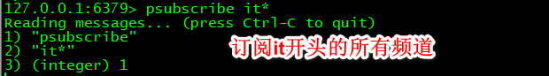
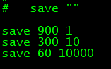

### 数据结构

- redis使用**单线程架构**和**IO多路复用模型**实现高性能的内存数据库服务。一条命令从客户端到达服务端不会立即被执行，所有命令都会进入一个队列中，然后逐个被执行。单线程模型还会达到每秒万级别的处理能力原因：

  1.  纯内存访问。
  2. 非阻塞IO。（使用epoll作为IO多路复用技术的实现，在加上Redis自身的事件处理模型将epoll中的连接、读写、关闭都转为事件，不在IO上浪费过多事件）
  3. 单线程避免的线程切换和竞态产生的消耗。

  但单线程模型中，如果某个命令执行时间过长，会阻塞其他命令，所以Redsi是面向快速执行场景的数据库。

- Redis5种数据结构：
  - string
    - 内部编码
      1. int（8字节长整型）
      2. embstr（<=39字节的字符串）
      3. raw（>39字节的字符串）
  - hash
    - 内部编码
      1. ziplist（ziplist更紧凑，比hashtable节省内存，当元素个数小于`hash-max-ziplist-entries` (默认512个)&& 所有的值小于`hash-max-ziplist-value`(默认64字节)时用ziplist）
      2. hashtable（hashtable读写时间复杂度为O(1)，比ziplist效率高）
  - list
    - 内部编码
      1. ziplist （当元素个数小于`list-max-ziplist-entries` (默认512个)&& 所有的值小于`list-max-ziplist-value`(默认64字节)时用ziplist）
      2. linkedlist 
      3. Redis3.2提供了quicklist内部编码，它是以ziplist为节点的linkedlist。
  - set
    - 内部编码
      1. intset （集合中元素都是整数且个数小于`set-max-intset-entries`(默认512)个时用intset，减少内存的使用）
      2. hashtable
  - zset(sort set)
    - 内部编码
      1. ziplist  （有序集合元素个数小于`zset-max-ziplist-entries`(默认128个)&&所有的元素值都小于`zet-max-ziplist-value`时用ziplist  ，减少内存的使用）
      2. skiplist

[操作命令](http://redisdoc.com/)

### Pipeline

- **Pipeline能组装一组Redis命令，通过一次RTT传输给Redis,再将这组Redis命令的执行结果按顺序返回给客户端。**（即批量执行客户端命令）

- 原生批量命令与Pipeline对比
  - 原生批量命令是原子的，Pipeline不是原子的
  - 原生批量命令是一个命令对应多个key，Pipeline支持多个命令
  - 原生命令是Redis服务端支持实现的，而Pipeline需要客户端、服务端共同实现。

### 事务

- Redis提供了简单的事务。不支持事务的回滚特性。可能一个命令错了，所有命令都不能执行(比如某个命令写错)，也可以一个命令错了，其他命令可以正常执行(运行时错误)。

- 常用命令

  `multi`：标记一个事务的开始。

  `exec`：执行事务块内的命令。

  `discard`：取消事务，放弃事务块内的所有命令。

  `watch`：监视一个或多个key，如果在事务执行前这些key被其他命令修改了，那么事务将会被打断。

 ### 发布订阅

- 进程建的一种消息通信模式：发送者发送消息，订阅者接收消息，发布者与订阅者不进行直接通信。

- 常用命令

  `publish channel message`：将message发送到channel频道

  `subscribe channle [channle...]`：订阅一个或多个频道

  `unsubscribe [channle [channle ...]]`：取消订阅

  

 
  `psubscribe pattern [pattern ...]`：按照模式订阅

 
  	`punsubscribe pattern [pattern ...]`：安装模式取消订阅

​	  `pubsub numpat`：查看模式订阅数

​	  `pubsub numsub [channle ...]`：查看频道订阅数

### 客户端通信协议

- 几乎所有的主流编程语言都有Redis的客户端，原因
  1. 客户端与服务端之间的通信协议基于TCP协议构建。
  2. Redis制定了RESP(Redis Serialization Protocol ，Redis序列化协议)实现客户端与服务端的正常交互。

### 持久化

#### RDB

- RDB持久化即把当前数据一次性生成快照保存到硬盘，产生文件压缩比更高，因此读取RDB速度更快。由于生成RDB开销大，无法做到实时持久化，所以一般用于数据备份和复制传输。
- 触发方式有手动触发和自动触发。
  - 手动触发：两个命令`save`和`bgsave`。
    - `save`：阻塞Redis服务器，直到RDB完成，这个过程中客户端不能连接
    - `bgsave`：Redis进程执行fork操作创建子进程，RDB持久化过程由子进程负责，完成后自动结束，阻塞只发生在fork阶段，一般时间很短。
  - 自动触发：在配置文件的SNAPSHOTTING栏，如下为默认配置。 `save m n`表示m秒内数据集存在n次修改就自动触发`bgsave`。可通过`save ""`关闭自动触发。

  

 

- `bgsave`执行流程：  
  1. 执行`bgsave`命令，父进程判断当前是否存在正在执行的子进程，如RDB/AOF。如果存在`bgsave`命令就直接返回。  
  2. 父进程执行fork操作，自身阻塞。  
  3. fork完成后`bgsave`命令返回`background saving started`信息并不再阻塞父进程。  
  4. 子进程创建RDB文件并对原有文件进行原子替换。  
  5. 进程发送信号给父进程表示完成，父进程更新统计信息。
- RDB优缺点
  - 优点
    1. RDB是一个紧凑压缩的二进制文件(LZF压缩算法)，适合备份和容灾恢复。
    2. Redis加载RDB恢复数据远快于AOF方式。
    3. RDB对redis对外提供读写服务的时候，影响非常小，因为redis 主进程只需要fork一个子进程出来，主进程不需进行任何磁盘IO操作。
  - 缺点
    1. 在一定间隔时间做一次备份，所以如果redis意外down掉的话，就会丢失最后一次快照后的所有修改。
    2. Fork的时候，内存中的数据被克隆了一份，大致2倍的膨胀性需要考虑。

#### AOF

- AOF持久化以日志的形式来记录每个写操作(读操作不记录)，只许追加文件但不可以改写文件，redis启动之初会读取该文件重新构建数据。

  使用AOF需要先开启，默认关闭，在配置文件的APPEND ONLY MODE下将` appendonly no`改为 `appendonly yes`即可开启。
- 运行流程

  1. 命令写入。所有写入的命令会追加到aof_buf(aof缓冲区)中。
  2. 文件同步。aof缓冲区根据对应的策略向硬盘做同步操作。
  3. 文件重写。随着aof文件越来越大，定期对aof文件重写以达到压缩目的。
  4. 重启加载。Redis服务器重启时，加载aof文件进行数据恢复。
  
  - 命令写入
    - 命令写入的内容是文本协议的格式，文本协议有很好的兼容性，而且可读性强，方便直接修改。
    - aof把命令追加到aof_buf中而不直接写入硬盘，这样redis可以提供多种缓冲区同步硬盘的策略，在性能和安全性方面做出平衡。
  - 文件同步策略
    - always：同步持久化 每次发生数据变更会被立即记录到磁盘  性能较差但数据完整性比较好。
    - everysec：出厂默认推荐，异步操作，每秒记录   如果一秒内宕机，有数据丢失。
    - no：从不同步。 
  - 重写机制
    - 当AOF文件的大小超过所设定的阈值时，Redis就会启动AOF文件的内容压缩，这样就降低了文件占用空间，而且更小的文件可以更快的被Redis加载。
    - 触发方式
      1. 手动触发：`bgrewriteaof`命令。
      2. 自动触发：配置文件中有`auto-aof-rewrite-percentage 100` 和`auto-aof-rewrite-min-size 64mb`两项配置，表示当AOF文件大小是上次rewrite后大小的一倍且文件大于64M时触发。
    - 重写流程
      1. 执行aof重写请求，如果当前进程正在执行aof重写，请求就不会执行并返回`err background append only file rewriting already in progress`；如果当前进程正在执行`bgsave`，重写命令延迟到`bgsave`完成后再执行，返回`background append only file rewriting scheduled`。
      2. 父进程执行fork创建子进程，开销等同于`bgsave`过程。
      3. 父进程fork操作完成后，继续响应其他命令。
      4. 由于fork操作运用写时复制技术，子进程只能共享fork操作时的内存数据。由于父进程依然会响应命令，Redis使用“aof重写缓冲区”保存这部分数据，防止新aof文件生成期间丢失这部分数据。
      5. 子进程根据内存快照，按照命令合并规则写入到新的aof文件。如果`aof-rewrite-incremental-fsync`配置为yes，则每次写32M。
      6. 新aof文件写入完成后，子进程发送信号给父进程，父进程更新统计信息。
      7. 父进程把“aof重写缓冲区”的数据写入到新的aof文件。
      8. 使用新aof文件替换老文件，完成aof重写。
  - 重启加载
  
    - aof开启并存在aof文件时，会优先加载aof。
    - 如果aof文件错误，可通过 `redis-check-aof --fix  <filename>`命令修复,修复后使用`diff -u`对比数据差异，找出丢失数据。
    - `aof-load-truncated`如果为yes(默认yes)，会兼容aof文件结尾不完整的情况。即在aof写入时，可能存在指令写错的问题(突然断电，写了一半)。

#### 总结

- aof文件是一个只进行追加的日志文件。
- redis可以在aof文件体积变得过大时自动在后台对aof进行重写。
- aof有序保存了对数据库所有的写入操作，这些写入操作以文本协议格式保存，因此aof文件容易被读懂。
- 对于相同数据集来说，aof文件通常大于rdb文件体积。
- 根据所使用的fsync策略，aof的速度可能会慢于rdb。

#### 持久化阻塞主线程场景

1. fork阻塞

   fork创建的子进程会复制父进程的空间内存页表，所以fork阻塞时间与进程总内存量息息相关。
   
   -  改善fork操作耗时
   
     - 优先使用物理机或支持fork操作的虚拟化技术。
   
     - 控制Redis实例最大可用内存。线上建议每个Redis实例内存控制在10GB内。
     - 合理配置Linux内存分配策略。
     - 降低fork操作频率。
   
2. aof追加阻塞

  - 阻塞流程

    1. 主线程负责写入aof缓冲区。
    2. aof线程负责每秒执行一次同步磁盘操作，并记录最近一次同步时间。
    3. 主线程负责对比上一次aof同步时间：如果距上次同步成功时间在2秒内，主线程直接返回；如果距上次同步成功时间超过2秒内，主线程会阻塞，直到同步操作完成。

    所以，everysec配置最多丢失2秒数据。

    如果系统fsync缓慢，会导致Redis主线程阻塞影响效率。

    解决阻塞要优化**系统硬盘负载**。

#### 多实例部署

- Redis单线程架构导致无法充分利用CPU多核特性，通常做法是在一台机器上部署多个Redis实例。
- 多个Redis实例会产生对CPU和IO的竞争，需要进行**隔离控制**。通过`info persistence`监控子进程运行状况。基于`info persistence`提供的指标，通过外部程序轮询控制aof重写操作的执行。

### 复制

- 在分布式系统中为了解决单点问题，通常会把数据复制多个副本部署到其他机器，满足故障恢复和负载均衡等需求。复制功能是Redis高可用的基础。

  #### 配置

  ​		一个主节点可以有多个从节点，一个从节点只能有一个主节点。复制的数据只能从主节点复制到从节点。配置方式(配从不配主)：

  1. 配置文件中加入`slaveof {masterHost} {masterPort}`随Redis启动而生效。
  2. `redis-server`启动命令后加入`--slaveof {masterHost} {masterPort}`
  3. 直接使用命令`slaveof {masterHost} {masterPort}`

  可通过`info replication`命令查看复制相关状态。

  ##### 断开复制

  - 在从节点执行`slaveof no one`断开与主节点的复制关系，但**仍会保留原有的数据**。

  - 在从节点执行`slaveof {newMasterIp} {newMasterPort}`会把当前从节点对主节点的复制切换到另一个主节点，并且**删除从节点当前所有数据**。

  ##### 安全性

  - 如果主节点设置了`requirepass`参数进行密码验证，那么从节点配置文件中需要配置`masterauth`参数与主节点密码保持一致。

  ##### repl-disable-tcp-nodelay

  - `repl-disable-tcp-nodelay`参数控制是否关闭`tcp_nodelay`，默认`no`，即开启`tcp_nodelay`。
    1. 若开启，主节点产生的命令数据无论大小都会及时发送到主节点。减小延迟增大了带宽。
    2. 若关闭，主节点会合并较小的TCP数据包。默认发送时间取决于Linux内核，一般默认40ms。减小了带宽增大了延迟。

  #### 拓扑结构

  1. 一主一从
     - 写命令并发较高时且需要持久化时，可以只在从节点开启aof，以此保证数据安全性及主节点的性能。但如果主节点脱机，要避免自动重启操作，因为重启后数据集会清空，这时从节点继续复制主节点会导致从节点数据也会被清空，应该在从节点执行`slaveof no one`断开复制关系。

  2. 一主多从(星形拓扑)
     - 一个主节点有多个从节点。读占比较大的场景中，可以把读命令发送到从节点来分担主节点压力；写并发量较高的场景中，会导致主节点写命令发送多次，过度消耗带宽且影响主节点性能。
  3. 树状主从(树状拓扑)
     - 通过引入复制中间层，降低了主节点的负载。

  #### 复制原理

  ##### 6个流程：

  1.  保存主节点信息

     ​		执行`slaveof...`命令后从节点值保存主节点信息，建立复制流程还未开始。

  2. 主从建立scoket连接

     ​		从节点通过内部每秒运行的定时任务维护复制相关逻辑，它发现新的主节点后会尝试建立socket连接。如果失败会无限重试或执行`slaveof no one`。

  3. 发送ping命令

     ​		从节点发送ping请求进行首次验证检测主从之间的socket是否可用以及主节点是否可以接受处理命令。

  4. 权限验证

     ​		如果主节点设置了`requirepass`参数，从节点必须配置`masterauth`参数保证与主节点相同的密码。

  5. 同步数据集

     ​		主从复制首次正常通信后，主节点会把持有的数据集全部发送给从节点。

  6. 命令持续复制

     ​		主结点会持续把写命令发送给从节点。

  ##### 数据同步

  2.8以上版本通过`psync`命令完成主从数据同步。

  - 全量复制：一般用于初次复制场景，主节点全部数据一次性发送给从节点。

  - 部分复制：处理主从复制因网络闪断等原因造成数据丢失的场景。主从节点再次连接后，会补发丢失数据。

  `psync`需要以下组件：

   1. 主从节点各自复制偏移量
  
      ​		主节点在处理完写命令后，会把命令的字节长度做累加记录，统计信息在`info replication`的`master_repl_offset`指标中。
  
      ​		从节点每秒种上报自身的复制偏移量给主节点，因此主节点保存了从节点的复制偏移量。从节点接收到主节点发送的命令后，也会累加记录到自身的偏移量。统计信息在`info replication`的`slave_repl_offset`指标中。
  
   2. 主节点复制积压缓冲区
  
      ​		复制积压缓冲区是保存在主节点上的一个先进先出的固定长度队列。默认大小1MB，当主节点有连接的从节点时被创建。这是主节点响应写命令时，不但会把命令发送给从节点，还会写入复制积压缓冲区。
  
      ​		能实现保存最近已复制数据的功能，用于部分复制和复制命令丢失的数据补救。相关统计信息保存在主节点的`info replication`中：
  
      ​		`repl_backlog_active:1`	//开启复制缓冲区
  
      ​		`repl_backlog_size:1048576`		//缓冲区最大长度
  
      ​		`repl_backlog_first_byte_offset:7479`	//起始偏移量，计算当前缓冲区可用范围
  
      ​		`repl_backlog_histlen:1048576`		//已保存数据的有效长度
  
   3. 主节点运行id
  
      ​		每个Redis启动后会动态分配一个40位的16进制字符串作为运行id，唯一标识Redis节点。如果从节点以 ip+port 方式识别主节点，主节点重启后变更了整体数据集(如替换RDB/AOF文件)，那么从节点再基于偏移量复制数据将是不安全的，需要做全量复制。
  
      ​		运行id通过`info server`命令查看：`run_id: ...`。
  
      ​		redis重启后，运行id会改变。如果想重启不改变id，可以用`debug reload`命令，它会阻塞当前Redis节点主线程，生成本地RDB快照并清空数据之后重新加载RDB文件，从而避免全量复制。
      
      - 从节点使用命令`psync {runid} {offset}`完成复制命令。runid是主节点id(没有则默认为?)，offset是当前从节点保存的复制偏移量(没有则默认为-1)。
      
        ​	主节点回复`+fullresync {runid} {offset}`将触发全量复制；
      
        ​	回复`+continue`将触发部分复制；
      
        ​	回复`+err`说明主节点版本低于2.8，无法识别`psync`命令，从节点将发送旧版的`sync`命令触发全量复制。
  
  ##### 心跳
  
  ​	主从节点建立复制后，他们之间维护着长连接并彼此发送心跳命令。主节点每隔10s向从节点发送`ping`命令(通过`repl-ping-slave-period`参数控制频率)；从节点每隔1s发送`replconf ack {offset}`向主节点汇报自身偏移量。
  
  ##### 异步复制
  
  ​	主节点把写命令发送给从节点的过程是异步完成的。
  
  #### 开发与运维中的问题
  
  ##### 读写分离
  
  主节点只写，在从节点读。问题：
  
   1. 数据延迟
  
      ​		因为异步复制，所以肯定有延迟。解决方案：建立监控程序定期检查主从节点偏移量，延迟字节量超过一定值时，通知客户端路由到其他从节点上。
  
   2. 读到过期数据
  
      ​		惰性删除：主节点每次读取命令时，都会检查键是否超时，如果超时则执行del删除键，del命令也会异步发给从节点。从节点自身永远不会主动删除超时数据。
  
      ​		定时删除：主节点内部定时任务会循环采样一定数量的键，发现采样的键过期时执行del，之后再同步给从节点。3.2版本中，从节点读取数据之前会检查键的过期时间来决定是否返回数据，以此解决数据大量超时情况。
  
   3. 从节点故障
  
      ​		此问题需要在客户端维护可用从节点列表，出故障时切换到其他从节点或主节点。
  
  ##### 规避全量复制
  
  ​	问题：
  
   1. 第一次建立复制
  
      ​	在低峰时进行操作。
  
   2. 节点运行id不匹配
  
      ​	主节点发生故障后，手动提升从节点为主节点或者采用支持自动故障转移的哨兵或集群方案。
  
   3. 复制积压缓冲区不足
  
      ​	增大积压缓冲区(默认1MB)
  
  ##### 规避复制风暴
  
  ​	复制风暴指大量从节点对同一主节点或同一机器的多个主节点短时间内发起全量复制的过程。
  
   1. 单主节点复制风暴
  
      ​	主节点重启恢复后，多个从节点发起全量复制流程。
  
      ​	解决方案：减少从节点数量或采用树状复制结构，加入中间层节点保护主节点。
  
   2. 单机器复制风暴
  
      ​	通常一台机器上部署多个Redis。当机器故障重启恢复时，会有大量从节点进行全量复制。
  	​	解决方案：主节点所在机器故障后提供故障转移机制。

### 阻塞

#### 发现阻塞

​	当Redis阻塞时，线上应用服务应该最先感知到，常见做法是在应用方加入异常统计并通过邮件/短信报警。可通过日志系统统计异常。

#### 内在原因

##### api或数据结构使用不合理

1. 发现慢查询

   解决方案：修改算法复杂度低的命令，比如`hgetall`改为`hmget`等；把大对象拆分成小对象。

2. 如何发现大对象

   Redis本身提供发现大对象的命令`redis-cli -h {ip} -p {port} --bigkeys`，内部原理采用分段进行scan。

##### cpu饱和

​	cpu饱和指Redis把单核CPU使用率跑到接近100%，可通过`top`命令查看Redis进程的CPU使用率，用`redis-cli -h {ip} -p {port} --stat`查看redis使用情况。如果每秒处理请求过多，需要做集群化水平扩展来分摊OPS压力。

##### 持久化阻塞

 1. fork阻塞

    ​	发生在RDB和AOF重写时。解决方案：见持久化部分fork阻塞解决方案

 2. aof刷盘阻塞

    ​	解决方案：见持久化部分fork阻塞解决方案

 3. HugePage阻塞

#### 外在原因

##### cpu竞争

##### 内存交换

##### 网络问题

### 理解内存

#### 内存管理

​		Redis使用`maxmemory`参数限制最大可用内存。但由于内存碎片的存在，实际消耗的内存可能会比`maxmemory`设置的更大。如果多台Redis消耗的总内存超过服务器物理内存，就需要采用在线迁移数据或通过复制切换服务器来达到扩容目的。

##### 内存回收策略

​	内存回收机制主要体现在两个方面：

- **删除到达过期时间的键对象**。

​		惰性删除：当客户端读取带有超时属性的键时，如果已经超过键设置的过期时间，就会执行删除操作并返回空。好处：不用单独维护TTL链表处理过期键的删除，节省了CPU；坏处：存在内存泄露，当过期键一直未被访问将无法得到及时删除，导致内存不能及时释放。

​		定时任务删除：Redis内部维护一个定时任务，默认每s运行10次。定时任务删除过期键采用了自适应算法。流程：

  1. 定时任务在每个数据库空间随机检查20个键，当发现过期时删除对应的键。
  2. 如果超过检查数25%的键过期，循环执行回收逻辑，知道不足25%或运行超为止，慢模式下超时时间为25ms.
  3. 如果之前回收逻辑超时，则Redis触发内部事件之前再次以快模式运行回收过期键任务。快模式下超时时间为1ms且2s内只能运行1次。
  4. 快慢模式删除键逻辑相同。

- 内存使用达到`maxmemory`上限时触发**内存溢出控制策略**。

  ​	具体策略受`maxmemory-policy`参数控制，通过`config set maxmemory-policy {ploicy}`动态配置。Redis支持6种策略：

   	1. `noeviction`：默认策略，不删除任何数据，只响应读操作，拒绝所有写操作并返回客户端错误信息。
   	2. `volatile-lru`：根据lru算法删除超时的键，直到腾出足够空间，如果没有可删除的键，退回到`noeviction`策略。
   	3. `allkeys-lru`：根据lru算法删除键，不管有没有设置超时属性，直到腾出足够空间。
   	4. `allkeys-random`：随机删除所有键，直到腾出足够空间。
   	5. `volatile-random`：随机删除过期键，直到腾出足够空间。
   	6. `volatile-ttl`：根据键值对象的ttl属性，删除将要过期的数据，如果没有，回退到`noeviction`。

#### 内存优化

##### redisObject对象

​		Redis存储的数据都使用redisObject来封装，包括string、hash、list、set、zset在内的所有数据类型。redisObject结构体对象由5个字段组成：

1. `type`：表示当前对象使用的数据类型，Redis主要支持5种数据类型string、hash、list、set、zset，可用`type {key}`查看对象所属类型。
 	2. `encoding`：代表当前对象采用哪种数据结构实现。
  3. `lru`：记录对象最后一次被访问的时间。
  4. `refcount`：记录当前对象被引用的次数。
  5. `*ptr`：与对象数据内容有关，如果是整数，直接存储数据；否则表示指向数据的指针。

	##### 缩减键值对象

​		缩减key和value的长度。

​		设计键时，键值越短越好。值对象序列化成二进制数据再存入Redis。如果需要存`json`、`xml`等类型数据，先压缩再存。

##### 共享对象池

​		Redis内部维护[0-9999]的整数对象池，用于节约内存。除了整数值对象，其他类型比如`list`、`hash`、`set`、`zset`等也可以使用整数对象池。开发时满足需求情况下，尽量使用整数对象池。

​		Redis中通过变量`REDIS_SHARED_INTEGERS`定义，不能通过配置修改。

##### 字符串优化

​		所有的键都是字符串类型。值对象除了整数外，都用字符串存储。

  1. 字符串结构

     Redis没用使用原生C语言的字符串类型，而是自己实现了字符串结构，内部简单动态字符串(`simple dynamic string`，`SDS`)。

     结构体组成：`len`：已用字节长度；`free`：未用字节长度；`char buf[]`：字节数组

     特点：

      	1. O(1)时间复杂度获取：字符串长度、已用长度、未用长度
      	2. 可用于保存字节数组，支持安全二进制数据存储。
      	3. 内部实现预分配机制，降低内存再次分配次数。
      	4. 惰性删除机制，字符串缩减后的空间不释放，作为预分配空间保留。

  2. 预分配机制

     防止修改操作需要不断重新分配内存和字节数据拷贝，但也会造成内存浪费。

  3. 字符串重构

     不一定把每份数据作为字符串整体存储，向json这样的数据可以使用hash结构，节省内存。

### 哨兵

#### 基本概念

​	**Redis Sentinel 是Redis高可用的实现方案。**

##### 主从复制问题	

​	好处：从节点可作为主节点数据的备份；扩展主节点读能力。

​	问题：

1. 一旦主节点出现故障，需要手动将一个从节点升为主节点，并且更新客户端的主节点地址，命令其他的从节点复制新的主节点。
2. 主节点写能力受单机限制。
   3. 主节点存储能力受单机限制。

##### Redsi Sentinel 的高可用性

​		**Redis是一个分布式架构，其中包含若干个Sentinel节点和Redis数据节点，每个Sentinel节点会对数据节点和其余Sentinel节点进行监控，当它发现节点不可达时，会对节点做下线标识。如果被标识的是主节点，它还会和其他Sentinel节点进行“协商”，当大多数Sentinel节点都认为主节点不可达时，它们就会选举出一个Sentinel节点来完成自动故障转移的工作，同时会将这个变化实时通知给客户端。整个过程完全自动。**

​		Redis Sentinel包含若干Sentinel节点，一方面防止误判，另一方即使个别Sentinel节点不可用，整个Sentinel节点集合依旧健壮。Sentinel节点就是不存储数据，只支持部分命令的Redis节点

##### 配置

​	因为每个Sentinel节点也是一个Redis节点，所以有一个sentinel.conf配置文件。

​	`port` ：Sentinel节点的端口

​	`dir`：Sentinel节点工作目录

​	`sentinel monitor <master-name> <ip> <port> <quorum>`：前三个参数表示Sentinel要监控的主节点的名称、IP、端口，quorum表示判断主节点最终不可到达所需的票数。Sentinel可以从主节点中获取有关从节点及其余Sentinel节点的相关信息。

​	`sentinel down-after-milliseconds <master-name> <times>`：每个Sentinel节点都要通过定期发送Ping命令判断Redis数据节点和其余Sentinel节点是否可达，如果超过了times没有有效的回复，就判断不可达。

​	`sentinel parallel-syncs <master-name> <nums>`：Sentinel节点集合对主节点故障判断达成一致时，会做故障转移，原来从节点会向新的主节点发起复制操作。parallel-syncs用来限制一次故障转移后，每次向新节点发起复制操作的从节点个数。

​	`sentinel failover-timeover <master-name> <times>`：故障转移超时时间

​	`sentinel auth-pass <master-name> <password>`：如果Sentinel监控的主节点设置了密码，这里就要添加密码。防止无法监控。

​	`sentinel notification-script <master-name> <script-path>`：故障转移期间，当一些警告级别的Sentinel事件发生(客观下线、主观下线)时，会触发对应路径的脚本。并向脚本发送相应的事件参数。

​	`sentinel client-reconfig-script <master-name> <script-path>`：故障转移结束后，会触发对应路径脚本。并向脚本发送故障转移结果的相关参数。

​	Redsi Sentinel可以同时监控多个主节点，通过master-name区分即可。

#### 客户端连接

​	主节点可通过master-name进行标识，所有客户端连接Redis Sentinel，必须有Sentinel节点集合和

master-name两个参数。

​	客户端需要遍历Sentinel节点集合，获取一个可用的Sentinel节点，通过`sentinel get-master-addr-by-name <master-name>`获取对应主节点信息，验证当前主节点是真正的主节点并和Sentinel节点集合保持联系，时刻获取主节点相关信息。

#### Redis Sentinel实现原理

##### 三个定时监控任务

1. 每隔10s，每个Sentinel节点会向主节点和从节点发送`info`命令获取最新的拓扑结构。
2. 每隔2s，每个Sentinel节点会向Redis数据节点的`_sentinel_:hello`频道发送该Sentinel节点对于主节点的判断以及当前Sentinel节点信息，每隔Sentinel节点也会订阅该频道，来了解其他Sentinel节点。
3. 每隔1s，每个Sentinel节点会向主节点、从节点、其余Sentinel节点发送一条ping命令做一次心跳检测，来确认这些节点是否可达。

##### 客观下线和主观下线

​	主观下线：每个Sentinel节点会每隔1s对主节点、从节点、其他Sentinel节点发送ping命令做心跳检测。当这些节点超过`down-after-milliseconds`没进行有效回复就做失败判定。

​	客观下线：当Sentinel主观下线的节点是主节点时，就会通过`sentinel is-master-down-by-addr <ip> <port> <current_epoch> <runid>`命令向其他Sentinel节点询问对主节点的判断，当超过`<quorum>`个数，就认为该主节点有问题。

​		ip：主节点ip

​		port：主节点端口

​		current_epoch：当前配置纪元

​		runid：等于"*"，Sentinel节点直接交换对主节点下线的判定；等于当前Sentinel节点的runid，当前Sentinel节点希望目标Sentinel节点同意自己成为领导者的请求。

##### 领导者Sentinel节点选举

​		如果Sentinel节点对主节点做了客观下线，就需要一个Sentinel节点来完成故障转移工作。所以Sentinel节点间会选举。选举大概思路：

  		1. 每个在线的Sentinel节点都有资格成为领导者，当他确认主节点客观下线时，会向其他Sentinel节点发送`sentinel is-master-down-by-addr`命令，要求将自己设为领导者。
  		2. 收到命令的Sentinel节点，如果没有同意过其他Sentinel节点的请求，将同意该请求，否则拒绝。
  		3. 如果该节点票数大于等于`max(quorum,num(sentinel)/2 + 1)`，那么它将成为领导者。
  		4. 如果此过程没选举出领导者，将进行下次选举。

##### 故障转移

 1. 领导者Sentinel节点选出一个节点作为新的主节点

    - 过来主观下线、断线
    
    - 选择复制偏移量大的

	- 选择runid小的

2. 对选出来的节点执行`slaveof no one`命令使其成为主节点。
3. 领导者Sentinel节点向剩余从节点发送命令，让他们成为新主节点的从节点。 

### 集群(Cluster)

​	Redis Cluster是Redis分布式的解决方案。

### 缓存

​	缓存能**加速应用读写速度**，也能**降低后端负载**。

​	成本：

1. 数据不一致性。缓存层(Redis)与存储层(mysql)的数据存在一定时间窗口的不一致性，时间窗口与更新策略有关。
2. 代码维护成本、运维成本。
   缓存使用场景：开销大的mysql无法满足的计算；加速请求响应。

​	

#### 缓存更新策略

 	1. lru/lfu/fifo 算法剔除
     - 使用场景：缓存使用量超过了预设最大值。
     - 一致性：开发人员只觉得用哪种算法，清理哪些数据由具体算法决定，所以数据一致性最差。
     - 维护成本：只需配置`maxmemory`和对应策略即可。
 	2. 超时剔除
     - 使用场景：通过给缓存数据设置过期时间，让其在过期时间后自动删除。
     - 一致性：一段时间窗口内(取决过期时间长短)存在一致性问题，即缓存数据与真实数据源数据不一致。
     - 维护成本：只需设置`expire`过期时间即可。
 	3. 主动更新
     - 使用场景：数据一致性要求高，需要在真实数据更新后，立即更新缓存数据。
     - 一致性：一致性最高。
     - 维护成本：维护成本高，需要开发者自己完成更新，且保证更新操作的正确性。

#### 缓存粒度控制

​		比如redis中缓存mysql中的一个user表，是缓存user的全部属性，还是缓存user的部分重要属性，这就是缓存粒度控制。

​		缓存全部属性时，通用性高，占用内存空间、网络带宽大，代码维护简单；缓存部分数据时，通用性低，占用内存空间、网络带宽小，代码维护比较复杂。

#### 穿透优化

​		缓存穿透指查询一个根本不存在的数据，缓存层和存储层都不会命中。

​		缓存穿透将导致不存在的数据每次请求都要到存储层去查询，失去了缓存保护后端存储的意义。缓存穿透问题可能会使后端存储负载增大，由于很多后端存储不具备高并发行，甚至可能造成后端存储宕掉。

​		缓存穿透基本原因：业务代码或数据出现问题；恶意攻击、爬虫造成大量空命中。
​		解决方案：

   1. 缓存空对象

      ​		客户端访问存储层没有命中后，存储层将空对象保留到缓存层，之后再访问这个数据将会从缓存中获取，这样就保护了后端数据源。

      ​		缓存空对象的问题：

      ​			空值做了缓存，即缓存层存了更多的键，需要更多的内存空间。解决方案：针对这类数据设置较短的过期时间。

      ​			缓存层和存储层会有一段时间窗口的不一致。例如，设置过期时间为5分钟，如果此时存储层添加了这个数据，就会出现存储层与缓存层数据不一致。解决方案：利用消息系统清掉缓存层中的空对象。

   2. 布隆过滤器拦截

      ​		在访问缓存层和存储层之前，将存在的key用布隆过滤器提前保存起来，做第一层拦截。如果布隆过滤器认为客户端访问的数据不存在，就不会访问存储层。

#### 缓存雪崩优化

​		由于缓存承载了大量请求，有效保护了存储层。但是如果缓存层由于某些原因不能提供服务，于是所有的请求都会到达存储层。存储层的调用量就会暴增，造成存储层也会级联宕机的情况。缓存雪崩英文原意是奔逃的野牛，指缓存层宕掉后，流量会像奔逃的野牛一样，打向后端存储。

​		解决方案：

1. 保证缓存层服务高可用。例如Redis  Sentinel和Redis Cluster都实现了高可用。
2. 依赖隔离组件为后端限流并降级。		
   3. 提前演练。项目上线前，演练缓存层宕掉后，应用以及后端的负载情况以及可能出现的问题，在此基础上做一些预案设定。

